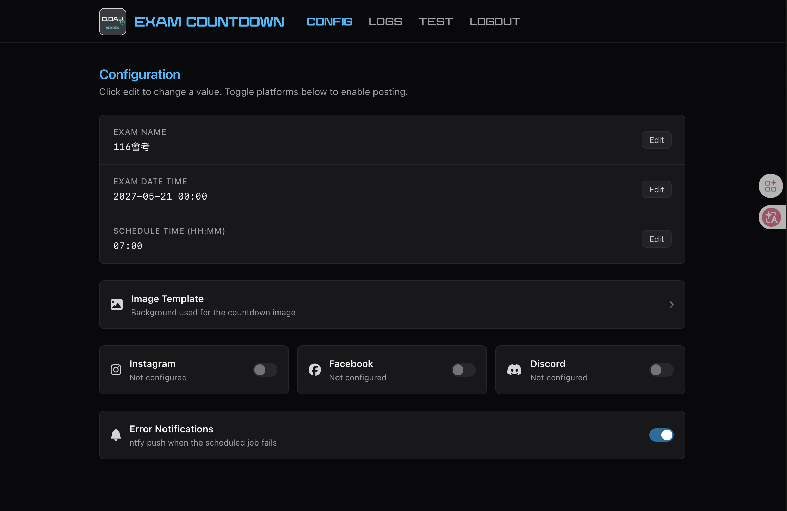
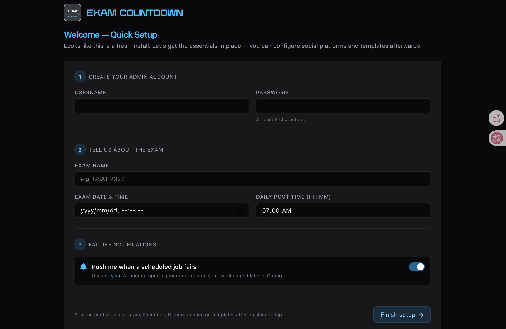
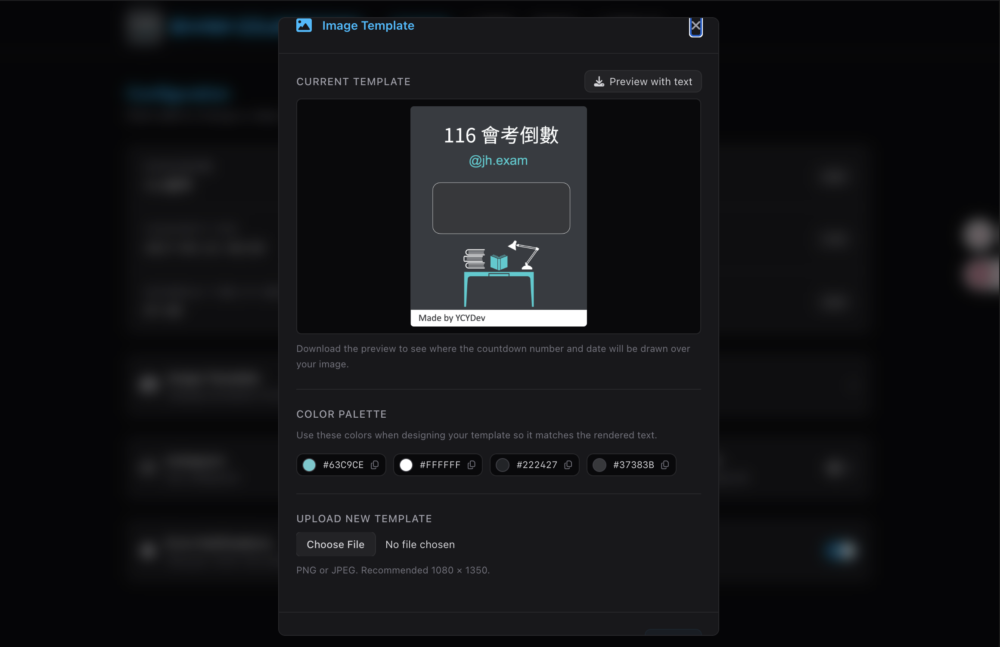
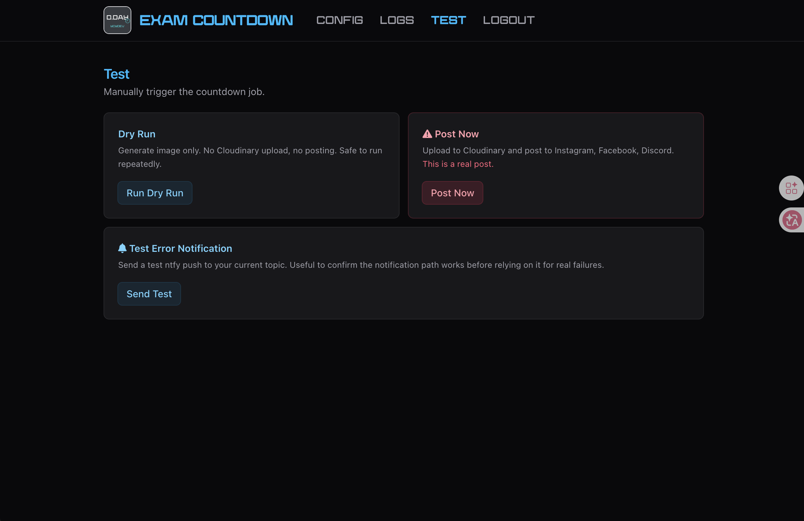

# Exam Countdown
A self-hosted solution for generating and publishing exam countdown images on social media platforms. Built with Python, FastAPI, and Jinja2.

## Supported platforms:
- Instagram
- Facebook
- Discord

## Features implemented:
Done:
- [X] Countdown image generation
- [X] Instagram auto-publishing
- [X] Facebook auto-publishing
- [X] Discord auto-publishing
- [X] Web-based configuration and logs
- [X] Navbar with RWD design
- [X] Live log streaming in web interface
- [X] User authentication for configuration access
- [X] Error handling and notifications
- [X] Landing page with quick setup
Planned:
- [ ] Support for multiple exams and platforms
- [ ] Multiple templates
- [ ] Multiple schedules per platform
- [ ] Multiple exam countdowns in one image
- [ ] AI-powered template design and scheduling suggestions

## Video Demo

<iframe width="560" height="315" src="https://www.youtube.com/embed/xD5xcwXOq-k" title="" frameBorder="0"   allow="accelerometer; autoplay; clipboard-write; encrypted-media; gyroscope; picture-in-picture; web-share"  allowFullScreen></iframe>

## Installation
Now you can run Exam Countdown with Docker Compose. Just copy [docker-compose.yml](docker-compose.yml) and [.env.example](.env.example) to `.env`, fill in the required environment variables, and run `docker-compose up -d`.

## Quick Setup Guide
1. Fill in the setup form and sign up for admin account.

2. Go to "Config" page, open `Image Template` modal, you can download it with text placeholders. What you need to do is to design your own template image (but don't add placeholders in the image), then upload it back to the system. You can use the color plette provided in the system to ensure design consistency.

3. Go to "Test" page, click "Dry Run" to see if the generated image looks good. If not, you can adjust the template and test again until you are satisfied with the result.

4. Back to "Config" page, you can setup your social media accounts and enable auto-publishing. 

## Social Media API Guides
To get the API for Facebook and Instagram, you need to create a Facebook App and connect your Instagram account to it. Then you can generate access tokens for both platforms. For Discord, you just need to create a webhook in your server and get the webhook URL.
Note: For Facebook, you need to get the `Page Access Token` for your Facebook Page, not the `User Access Token`. The `Page Access Token` is required for posting to Facebook as well.

## Ntfy Integration
Exam Countdown also supports Ntfy for notifications. It is enabled by default, and you can configure the topic in the config page. You can use it to receive error messages. To protect your token security, the system will auto hide the long text in error message in notifications, and you can check the full error message in logs. You need to keep the topic secret. You can also disable Ntfy integration if you don't want to use it.